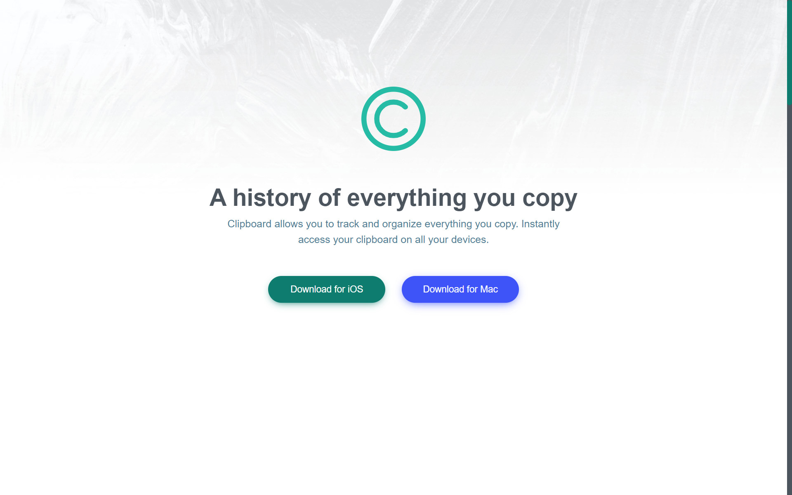

## Clipboard Landing Page

link to the website : https://ahmedhanye.github.io/clipboard-landing-page/

This repository contains the source code for a responsive landing page for Clipboard, a service that allows users to track and organize everything they copy. The landing page is designed using HTML, CSS, and some basic JavaScript.

### Project Overview

Clipboard Landing Page is a simple yet elegant web page that showcases the features and benefits of Clipboard. It is designed to be visually appealing and responsive, ensuring a seamless user experience on various devices.

### Features

- **Responsive Design**: The landing page is fully responsive, ensuring it looks great on all screen sizes, from mobile devices to large desktop screens.

- **Cloud Sync**: The page emphasizes the benefits of Clipboard's cloud synchronization, allowing users to access their snippets on all devices instantly.

- **Feature Highlights**: It highlights key features of Clipboard, such as quick search, iCloud sync, and complete history.

- **Supercharge Your Workflow**: The page showcases tools like creating blacklists, plain text snippets, and sneak previews to boost productivity.

- **Download Links**: Users can easily download the Clipboard app for iOS and Mac with direct download buttons.
